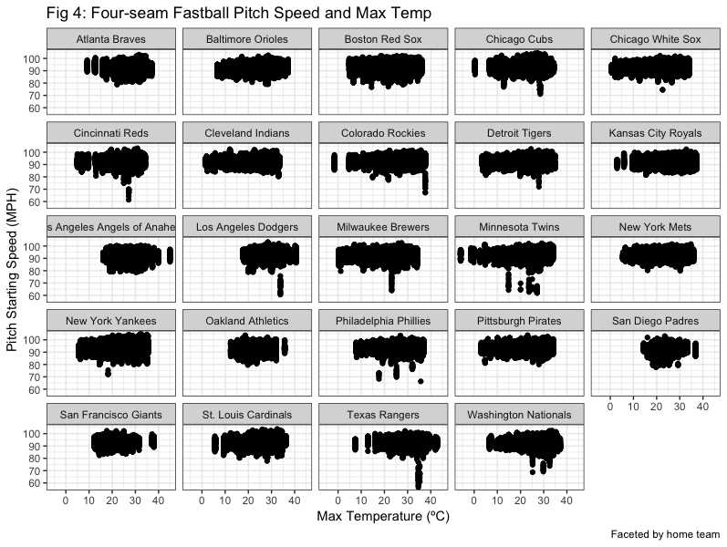

<style type = "text/css">

body{ /* Normal */
    font-size: 14px;
    color: Black;
}
td { /*Table */
  font-size: 8px; 
}
h1.title {
font-size: 38px;
color: DarkRed;
}
h1{ /* Header 1 */
  font-size: 28px;
  color: DarkRed;
}
h2{ /* Header 2 */
font-size: 22px;
color: Black;
}
</style>
```{r setup, include=FALSE}
knitr::opts_chunk$set(echo = FALSE)
library(tidyverse)
library(knitr)
library(kableExtra)
library(weathermetrics)

knitr::opts_chunk$set(
  fig.width = 6,
  fig.asp = .6,
  out.width = "90%"
)

theme_set(theme_bw() + theme(legend.position = "bottom"))

```


Initially, our team hypothesized that the proportion of pitches that are fastballs on any given day may decrease during warmer temperatures, and so a graph of the proportion of fastballs and maximum temperature was created (AD2, below).However, the graph indicated that absolutely no association existed between these variables.

## Fig.2

Next, several graphs were created to explore the associations between the speed of fastballs and maximum temperature (AD3). Graphs that depicted fastball speed and temperature overall did not suggest specific associations (not shown), so the data was instead faceted by various variables to explore the potential for variation by items such as pitch outcome, team, and pitch type. As one example below, fastball pitch speed against max temperature was plotted, and then faceted by pitch outcome (such as Strikeout, Walk, Single, etc).

Interestingly, we can see from the increase in points on the right side of facets such as "Double," "Flyout," "Lineout," "Home Run," and other outcomes that pitch outcome may be affected by temperature. It may be possible that when temperatures are higher, pitches are slightly slower and thus are more likely to result in hits.

##Fig.3


In further exploratory analysis, fastball speed and tempearture was also faceted by home team name (shown below), inning, and fowl/ball/strike status, and a graph of max temperature and pitch speed for all pitches, faceted by pitch type, was created (all not shown). There were some variations by inning and home team, and after discussion, we decided this might in fact be representative of changes in pitcher, and differences in whether or not a pitcher from a specific team typically played in warmer or colder weather. This possibility was explored next.

##Fig.4


