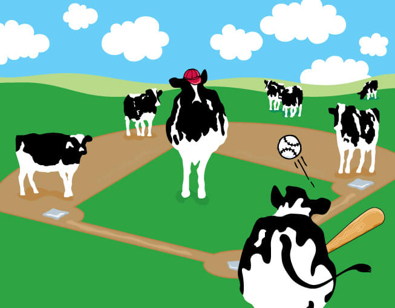

<style type = "text/css">

body{ /* Normal */
    font-size: 14px;
    color: Black;
}
td { /*Table */
  font-size: 8px; 
}
h1.title {
font-size: 38px;
color: DarkRed;
}
h1{ /* Header 1 */
  font-size: 28px;
  color: DarkRed;
}
h2{ /* Header 2 */
font-size: 22px;
color: Black;
}
</style>

<center>
<figure>

<figcaption> Giant cow playing baseball </figcaption>
</figure>
</center>


## Introduction
Advanced statistical analytics are central to evaluating players, developing teams, and informing in-game decisions throughout professional sports. The growing influence of sport analytics is arguably most evident in Major League Baseball, where teams that prioritize [sabermetrics](https://sabr.org/sabermetrics) have won the last three World Series. Baseball is uniquely suited to statistical analysis, as its components – pitching, hitting, and fielding – are discrete events that result in unambiguous decisions, as classified by the official game scorers, and can be attributed to specific players. Baseball also generates a substantial amount of data; the 30 MLB teams play a combined 2,430 games in the regular season, during which over 900,000 pitches are thrown across more than 165,000 at-bats. 

Our goal was to build on this body of work by examining the association between weather variables – temperature, humidity, and relative humidity – and the speed of pitches. We hypothesized that on extremely hot days (>35 ºC): 1) pitch speed would decrease and 2) the proportion of non-fastball to fastball pitches would increase. 

## Presentation 
```{r echo=FALSE}
library(vembedr)
```

```{r echo=FALSE}
embed_url("https://www.youtube.com/watch?v=tLB8QieR3DI&feature=youtu.be")
```

## Data
* Baseball Data
We used the [PITCHf/x database]( https://pitchrx.cpsievert.me/) from MLB Advanced Media to collect data for every pitch thrown between 2016 and 2018. PITCHf/x is a system of cameras set up at every MLB stadium that collects pitch data including speed, type, and trajectory. 
* Weather Data
We obtained our weather data from the Parameter-elevation Regressions on Independent Slopes Model ([PRISM]( https://developers.google.com/earth-engine/datasets/catalog/OREGONSTATE_PRISM_AN81d)) Daily Spatial Climate Dataset (AN81d) developed by the PRISM Climate Group based at Oregon State University. This is a gridded climate model that assimilates station data from networks around the United States. We extracted daily temperature and humidity measures for each ballpark location. 

## Methods
We conducted [exploratory data analysis]() to identify overall trends between our weather variables - **maximum temperature(ºC), relative humidity (expressed as a percentage), and heat index (ºC)** - and pitch speed or type. To become more familiar with the data, we created a series of graphs to explore potential associations between pitch speed and the weather variables. 

We also investigated whether the relationship between pitch speed and temperature was modified by a team’s home location. In other words, were teams that played the majority of their games in cooler climates, i.e. the Boston Red Sox, more affected by heat when they played in hotter climates, for example at the Texas Rangers stadium?  We compared home team vs. visiting team pitch speed in Arlington, Texas, home of the Rangers, and Boston, home of the Red Sox, to see if there was a difference in speed between teams acclimatized to extremes, and those that were not. Furthermore, we created a Shiny plot of [all pitches thrown by visiting pitchers]( https://brennanhilton.shinyapps.io/Pitch_Speed_at_the_Texas_Rangers_Stadium/) at the Rangers’ ballpark by maximum daily temperature to determine if pitch speed decreased with increasing temperature. 

The association between pitch speed/ type and humidity was uninformative, but we used the humidity and temperature data to calculate heat index, which is a better measure than air temperature for estimating the risk to workers from environmental heat sources. We faceted the heat index by geographic region in the United States and assessed its association with pitch speed and type. 

Finally, we used simple linear regression models to quantify the effect of daily heat index and maximum daily maximum temperature on the speed of four-seam fastballs. 

## Results
There was no strong association between maximum daily temperature and four-seam fastball speed (**Fig.2**), though there was some evidence that pitch outcome might be influenced by temperature. There seems to be a slight increase in the number of doubles, homeruns, flyouts, and lineouts at higher temperatures, which suggests that batters have more, or better, contact with these pitches (**Fig.3**). The association could be due to slower pitch speeds, at least for some pitchers. 

The plot of fastball pitch speed by max temperature, faceted by home team, suggested that temperature may affect pitches thrown at several stadiums (**Fig.4**). We found that the Rangers’ pitchers were less affected by high temperatures compared to visiting pitchers, who experienced a slight decrease in fastball speed (**Fig.5a**). In Boston, it appears that visiting pitchers threw slower four-seam fastballs at colder temperatures, whereas Red Sox pitchers were more consistent regardless of temperature.

Daily heat index was most variable in the Southwest and Southeast regions, and relatively stable in the West (**Fig.6**). There were no overall associations between pitch speed and heat index (**Fig.7**), though there did seem to be more outliers, i.e. slower pitches, at high heat indexes. 

The linear regression models showed that there was a statistically significant, but likely meaningless, positive association between maximum daily temperature or heat index, and pitch speed. 

## Discussion
We found that there is a small, but measurable, positive effect of temperature and heat index on the start speed of four-seam fastballs (**Table 1**). This is consistent with [previous reserach]() that found an assocation etween cold temperatures and decreasing pitch speed. The overall trend might mask, however, a decrease in four-seam fastball pitch speed at extreme temperature and/or heat index values. Visiting pitchers playing in Arlington, Texas, for example, had slightly slower four-seam fastballs at higher maximum daily temperatures compared to Rangers' pitchers. This finding suggests that among players unaccustomed to playing in extreme temperatures (>35ºC), there may be a tipping point at which heat has a detrimental effect on performance. 

### Brennan Baker | Nicole Comfort | Stephen Lewandowski | Tory Lynch | Jenni Shearston

#### bhb2128, nc2710, sal2222, vdl2103, js5431