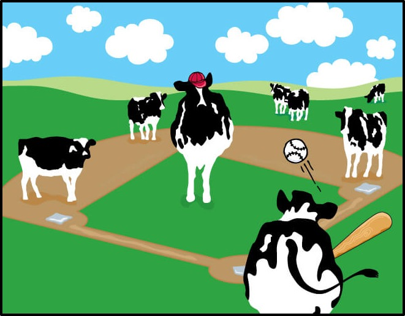

 


<center>
<figure>

<figcaption> Giant cow playing baseball </figcaption>
</figure>
</center>


#### Introduction

Advanced statistical analytics are central to evaluating players, developing teams, and informing in-game decisions throughout professional sports. The growing influence of sport analytics is arguably most evident in Major League Baseball, where teams that prioritize [sabermetrics](https://sabr.org/sabermetrics) have won the last three World Series. Baseball is uniquely suited to statistical analysis, as its components – pitching, hitting, and fielding – are discrete events that result in unambiguous decisions, as classified by the official game scorers, and can be attributed to specific players. Baseball also generates a substantial amount of data; the 30 MLB teams play a combined 2,430 games in the regular season, during which over 900,000 pitches are thrown across more than 165,000 at-bats. 

Our goal was to build on this body of work by examining the association between weather variables – temperature, humidity, and relative humidity – and the speed of pitches. We hypothesized that on extremely hot days (>35 ºC): 1) pitch speed would decrease and 2) the proportion of non-fastball to fastball pitches would increase. We used the PITCHf/x database from MLB Advanced Media to collect data for every pitch thrown between 2016 and 2018 and extracted daily temperature and humidity measures for each ballpark location from the PRISM database. 

We conducted [exploratory data analysis](file:///Users/victorialynch/Desktop/Data%20Science/hot_humid_baseball.github.io/EDA.html#maximum-temperature) to identify overall trends between weather variables and pitch speed or pitch type. We also used [simple linear regression models]() to determine the effect of daily heat index and daily maximum temperature on the speed of four-seam fastballs. Finally, we focused on games played at Globe Life Park in Arlington, Texas, home of the Rangers, and [examined the pitch speed of visiting pitchers](), who presumably have not adapted to the extreme Texas heat, across heat extremes. 

We describe our data sources, methods, and full results in our [full report](). 
#### Presentation 
```{r echo=FALSE}
library(vembedr)
```

```{r echo=FALSE}
embed_url("https://youtu.be/LPazONtQ080")
```


#### Brennan Baker | Nicole Comfort | Stephen Lewandowski | Tory Lynch | Jenni Shearston
##### bhb2128, nc2710, sal2222, vdl2103, js5431