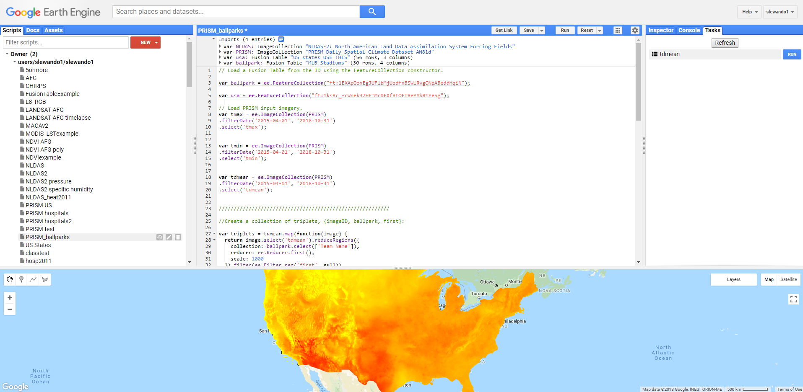

---
title: "Report - Hot Humid Basball"
output: 
  github_document:
    toc: true
---
```{r setup, include=FALSE}

library(tidyverse)
library(lubridate)
library(pitchRx)
library(knitr)
library(kableExtra)
library(weathermetrics)

<<<<<<< HEAD
knitr::opts_chunk$set(
  fig.width = 6,
  fig.asp = .6,
  out.width = "90%"
)

theme_set(theme_bw() + theme(legend.position = "bottom"))


=======
theme_set(theme_bw() + theme(legend.position = "bottom"))

>>>>>>> e7cdbcf03fefee8da0d5a86b54d3dd67713fa682
```

By: Brennan Baker, Nicole Comfort, Victoria Lynch, Stephen Lewandowski, Jenni Shearston

## Motivation and Related Work

<<<<<<< HEAD
Advanced statistical analytics are central to evaluating players, developing teams, and informing in-game decisions throughout professional sports. The growing influence of sport analytics is arguably most evident in Major League Baseball, where teams that prioritize [sabermetrics] (https://sabr.org/sabermetrics) have won the last three World Series. Baseball is uniquely suited to statistical analysis, as its components – pitching, hitting, and fielding – are discrete events that result in unambiguous decisions, as classified by the official game scorers, and can be attributed to specific players. Baseball also generates a substantial amount of data; the 30 MLB teams play a combined 2,430 games in the regular season, during which over 900,000 pitches are thrown across more than 165,000 at-bats. 
=======
Advanced statistical analytics are central to evaluating players, developing teams, and informing in-game decisions throughout professional sports. The growing influence of sport analytics is arguably most evident in Major League Baseball, where teams that prioritize [sabermetrics](https://sabr.org/sabermetrics) have won the last three World Series. Baseball is uniquely suited to statistical analysis, as its components – pitching, hitting, and fielding – are discrete events that result in unambiguous decisions, as classified by the official game scorers, and can be attributed to specific players. Baseball also generates a substantial amount of data; the 30 MLB teams play a combined 2,430 games in the regular season, during which over 900,000 pitches are thrown across more than 165,000 at-bats. 
>>>>>>> e7cdbcf03fefee8da0d5a86b54d3dd67713fa682

Sabermetric analysts sift through this exhaustive amount of data to identify competitive advantages among increasingly similar, dominant players. The arms race between pitchers and hitters has elevated the game, as pitchers are throwing harder and batters are hitting more home runs than at any point in MLB history. 

In addition to assessing player matchups, analysts aim to identify external factors that could influence players’ performances, particularly weather.  Over the course of a six-month MLB season, teams expect to play in a range of weather extremes, from 100-degree days in Los Angeles to snowy conditions in Milwaukee in the early spring. A growing body of sabermetric research has found that game-day weather affects [the number of home runs](https://journals.ametsoc.org/doi/abs/10.1175/WCAS-D-13-00002.1), [total runs scored](https://www.betlabssports.com/blog/mlb-runs-scored-influenced-temperature/), and [pitcher ball control](https://www.fangraphs.com/blogs/what-pitchers-and-numbers-say-about-pitching-in-the-cold/). 

Our goal was to build on this body of work by examining the association between weather variables – temperature, humidity, and relative humidity – and the speed of pitches. We hypothesized that on extremely hot days (>35 ºC): 1) pitch speed would decrease and 2) the proportion of non-fastball to fastball pitches would increase. We used the PITCHf/x database from MLB Advanced Media to collect data for every pitch thrown between 2016 and 2018 and extracted daily temperature and humidity measures for each ballpark location from the PRISM database. We conducted exploratory data analysis to identify overall trends between weather variables and pitch speed or pitch type. We also used simple linear regression models to determine the effect of daily heat index and daily maximum temperature on the speed of four-seam fastballs. Finally, we focused on games played at Globe Life Park in Arlington, Texas, home of the Rangers, and examined the pitch speed of visiting pitchers, who presumably have not adapted to the extreme Texas heat, across heat extremes. 
 

## Project Questions

Initially, our project aimed to answer the following overarching question:

<<<<<<< HEAD
* What is the association between weather and the speed and type of baseball pitches? We hypothesized that the speed and type of Major League Baseball (MLB) pitches may be negatively impacted by extreme weather.  

To operationalize this, we obtained MLB data and daily weather data for the years 2016, 2017, and 2018, focusing on the following weather data: **maximum (max) temperature (ºC), relative humidity, and heat index (ºC).** We then focused in on four-seam fastball pitches in particular, hypothesizing that these pitches may be most affected by temperature, humidity, and heat index.  

As our research progressed and it became clear that overall trends relating max temperature and pitch speed were not apparent, we began to investigate whether the relationships between pitch speed and weather variables could be modified by team, specifically whether a team *typically* played in an extreme weather condition. In other words, were teams that played the majority of their games in cooler climates, i.e. the Boston Red Sox, more affected by heat when they played in hotter climates, for example at the Texas Rangers stadium?  
=======
* What is the association between weather and the speed and type of baseball pitches? 

To operationalize this, we obtained MLB data and daily weather data for 2016-2018, using  **maximum (max) temperature (ºC), relative humidity, and heat index (ºC)** as weather variables. We then focused on four-seam fastball pitches in particular, hypothesizing that these pitches may be most affected by temperature, humidity, and heat index, as pitchers try to throw them as fast as possible to gain a competitive edge.  

As our research progressed and it became clear that overall trends relating max temperature and pitch speed were not apparent, we began to investigate whether the relationships between pitch speed and weather variables could be modified by team location, specifically whether a team *typically* played in an extreme weather condition. In other words, were teams that played the majority of their games in cooler climates, i.e. the Boston Red Sox, more affected by heat when they played in hotter climates, for example at the Texas Rangers stadium?  
>>>>>>> e7cdbcf03fefee8da0d5a86b54d3dd67713fa682

We proposed the following analytic deliverables (AD) in our submitted project proposal: 

* Linear model for the effect of temperature on pitch speed (fastball), adjusted for pitcher and other covariates to be determined. (AD1)

* Graph of variation in proportion of fastball vs off-speed pitches and temperature (AD2)

* Graph of speed of fastballs and maximum temperature (AD3)

* Graph of pitch speed (all pitch types) and relative humidity (AD4)

* Graph of pitch speed (all pitch types) and heat index (AD5)

## Collecting and Tidying Data

Data were collected in two major chunks: weather data from the PRISM Climate Group and baseball data from Pitchf/x. The process for scraping and pulling data is described below in detail, and data is housed on a series of Google Drive documents, linked below. 

### Weather data - Overview

#### PRISM climate model  

We obtained our weather data from the Parameter-elevation Regressions on Independent Slopes Model (PRISM) Daily Spatial Climate Dataset (AN81d) developed by the PRISM Climate Group based at Oregon State University. This is a gridded climate model that assimilates station data from networks around the United States and applies interpolation routines to simulate variations with elevation, coastal effects, temperature inversions, and terrain barriers. The model includes 7 bands of output parameters at a 2.5 arc minute grid resolution (https://developers.google.com/earth-engine/datasets/catalog/OREGONSTATE_PRISM_AN81d).

#### Google Earth Engine  

Using the code editor in the Google Earth Engine platform (https://code.earthengine.google.com), we extracted maximum daily temperature (`tmax`), minimum daily temperature (`tmin`), and mean daily dew point temperature (`tdmean`) from April 2015 through October 2018 at each MLB stadium location. We obtained the latitude and longitude coordinates for each ballpark from a Google Fusion Table (https://fusiontables.google.com/DataSource?docid=1EXApOoxEgJUFlbMjUodfxBSWlRvgQNpABeddHqiN#rows:id=1), which we imported to Earth Engine. We used JavaScript code to create arrays that collect each weather parameter mapped over each ballpark location for each day, reduced to the first observation reflecting the grid at the point of interest, which are then flattened to two dimensional tables.    



<<<<<<< HEAD
Figure 1. The image above is a screenshot of the Earth Engine code editor. The map displays maximum daily temperatures across the United States on July 05, 2018 from the PRISM model.
=======
**Fig 1:** The image above is a screenshot of the Earth Engine code editor. The map displays maximum daily temperatures across the United States on July 05, 2018 from the PRISM model.
>>>>>>> e7cdbcf03fefee8da0d5a86b54d3dd67713fa682

The JavaScript code for downloading PRISM data is provided at (gee.html). A registered Google account is required to access the code editor. 

#### Tidy weather data  

Next, we imported the PRISM files for `tmax`, `tmin`, and `tdmean` into R, tidied the data from "wide" format to "long" format, and joined each parameter to a single dataframe by team and date. We created daily heat index values (`heat_index`) from mean daily air temperature and mean daily dew point temperature using the `heat.index` function of the `weathermetrics` package, which applies a heat index equation derived from the US National Weather Service's online heat index calculator. We also used the `dewpoint.to.humidity` function to obtain relative humidity (`rh`).   

#### Reproducibility  

The raw data files from Earth Engine and the stadium index from Fusion Table are available at the links below:  

"tdmean_ballpark.PRISM.csv": https://drive.google.com/open?id=11Wptk3Eaul1rJEmXB2Xb9T7G_B82i3MK  
"tmin_ballpark.PRISM.csv"  : https://drive.google.com/open?id=1gtjdciCF4zJmrcyjXnUrj-JNDs437MCa  
"tmax_ballpark.PRISM.csv"  : https://drive.google.com/open?id=1AYqLA1Qp3tOOG7hltIN9-aXuYUkF3SSq  
"stadium_index.csv"        : https://drive.google.com/open?id=13mteZpqRSzkeUObmaL6VwYT9s3QNlDOo  
 
The geocoded stadium index source is: https://fusiontables.google.com/DataSource?docid=1EXApOoxEgJUFlbMjUodfxBSWlRvgQNpABeddHqiN#rows:id=1

The joined and cleaned weather dataframe, `weather.csv`, is available at:

"weather.csv" : https://drive.google.com/open?id=1jr1_sSAzSn8SVKralTHWGdQWH0BEX08W

#### Weather data - Complete pipeline

See the code below for the above-described steps.

<<<<<<< HEAD
```{r weather_pipeline}
=======
```{r weather_pipeline, warning = FALSE, message = FALSE}
>>>>>>> e7cdbcf03fefee8da0d5a86b54d3dd67713fa682
# Import stadium index
stadium_index = read_csv("./data/stadium_index.csv")

# Import PRISM variables
# Import max and min daily temperatures and mean daily dew points for all MLB stadium locations from April 2015 to October 2018.

tmax =
  read_csv("./data/tmax_ballpark_PRISM.csv") %>% 
    janitor::clean_names() %>% 
    select(-c("system_index", "geo")) %>% 
    select(team_name, everything()) %>% 
    gather(key = date, value = tmax, "x20150401":"x20181030")
  
tmin =
  read_csv("./data/tmin_ballpark_PRISM.csv") %>% 
    janitor::clean_names() %>% 
    select(-c("system_index", "geo")) %>% 
    select(team_name, everything()) %>% 
    gather(key = date, value = tmin, "x20150401":"x20181030")

tdmean =
  read_csv("./data/tdmean_ballpark_PRISM.csv") %>% 
    janitor::clean_names() %>% 
    select(-c("system_index", "geo")) %>% 
    select(team_name, everything()) %>% 
    gather(key = date, value = tdmean, "x20150401":"x20181030")

# Join PRISM data
# Join `tmax`, `tmin` and `tdmean`

weather <- as.tibble(
    full_join(tmax, tmin, by = c("team_name", "date")) %>% 
    full_join(., tdmean, by = c("team_name", "date")) %>% 
    mutate(date = str_replace(date, "x", ""),
           date = as.Date(date, format = "%Y%m%d"))
  )

# Heat Index and Relative Humidity (RH)
# Calculates daily heat index values from mean daily air temperature and mean daily dew point temperature using `heat.index` function of the `weathermetrics` package is used.  The `dewpoint.to.humidity` function is used to obtain relative humidity.

weather <-
  weather %>% 
    mutate(tmean = (tmax + tmin)/2,
           heat_index = weathermetrics::heat.index(t = tmean, dp = tdmean, temperature.metric = "celsius", output.metric = "celsius", round = 2),
           rh = weathermetrics::dewpoint.to.humidity(dp = tdmean, t = tmean, temperature.metric = "celsius"))

weather

# Export tidy weather dataframe
write_csv(weather, path = "./data/weather.csv") 

```


### Baseball data

#### PITCHf/x data

PITCHf/x is a system of cameras set up at every MLB baseball stadium that collects pitch data including pitch speed, type, and trajectory. The data are stored in XML format and maintained by MLB Advanced Media.

#### Helpful packages

<<<<<<< HEAD
We gathered PITCHf/x data using the r package “pitchRx” (https://pitchrx.cpsievert.me/).  The “pitchRx” package relies on the “XML2R” package to easily convert XML tables into data tables in r. In particular, the “scrape” function in the “pitchRx” package allows you to gather all the pitch data between a specified start and end date.

Gathering a large amount of pitch data, however, may use up too much random-access memory. To solve this problem, we used the “dplyr” package to create an SQLite database, which aids in memory management. 

The baseball data used for this project can be accessed by Google Drive here: (https://drive.google.com/drive/u/0/search?q=sqlite)
=======
We gathered PITCHf/x data using the r package [“pitchRx”](https://pitchrx.cpsievert.me/).  The “pitchRx” package relies on the “XML2R” package to easily convert XML tables into data tables in r. In particular, the “scrape” function in the “pitchRx” package allows you to gather all the pitch data between a specified start and end date.

Gathering a large amount of pitch data, however, may use up too much random-access memory. To solve this problem, we used the “dplyr” package to create an SQLite database, which aids in memory management. 

The baseball data used for this project can be accessed by Google Drive [here.](https://drive.google.com/drive/u/0/search?q=sqlite)
>>>>>>> e7cdbcf03fefee8da0d5a86b54d3dd67713fa682

#### Gathering pitch data

The data was scraped into an SQlite3 database that was stored on a personal computer so that the user did not have to scrape it at a later time. We brought this data into an R session by creating SQlite3 database representations (called "pitch" and "atbat" below). Finally, we loaded in the weather data, an index of the team names, and their corresponding abbreviations.

<<<<<<< HEAD
```{r import all data}
=======
```{r import all data, warning=FALSE, message=FALSE}
>>>>>>> e7cdbcf03fefee8da0d5a86b54d3dd67713fa682

# The first argument is the path to the SQlite database. 
# If create is set to TRUE, the code will create a new SQlite3 database at the specified path if it does not exist. If the path does exist, it will connect to the existing database.

my_db <- src_sqlite("./data/GamedayDB.sqlite3", create = TRUE)

# Only run the code below if you have never scraped the data. This code collects and stores all PITCHf/x data from one date to the next, and saves it as GamedayDB.sqlite3.
####### scrape(start = "2016-04-03", end = Sys.Date() - 1,
####### suffix = "inning/inning_all.xml", connect = my_db$con)


# Create pitch and atbat, which are representations of data in my_db. That is, pitch does not actually pull data from every pitch into memory, but is a portrayal of the relevant data sitting in my_db.
pitch = tbl(my_db$con, "pitch")
atbat = tbl(my_db$con, "atbat")


# Import team names data
team_names = read_csv("./data/team_abbrv.csv")

# Import weather data 
weather_db = read_csv("./data/weather.csv")

```

<<<<<<< HEAD
## Combining Datasets

Below, we bring the pitch data into R from the SQlite3 database using the representations created above. Then we tidy the pitch data and combine it with the weather data:

```{r tidy pitch data, message = FALSE}
=======
### Combining Datasets

Below, we bring the pitch data into R from the SQlite3 database using the representations created above. Then we tidy the pitch data and combine it with the weather data:

```{r tidy pitch data, message = FALSE, warning=FALSE}
>>>>>>> e7cdbcf03fefee8da0d5a86b54d3dd67713fa682

# First line collects data into an r dataframe from the pitch and atbat representations established above
pitch_tidy_db = collect(inner_join(pitch, atbat, by = c("num", "url"))) %>% 
  # Extract home and away team information from url link
  separate(gameday_link.x, into = c("remove", "away_home"), sep = ".............._") %>%
  separate(away_home, into = c("away", "home"), sep = "mlb_") %>% 
  # Tidy date
  mutate(date = ymd(date)) %>% 
  # Joining pitch with atbat created redundant columns coded .x or .y. Remove redundant cols ending with .y. Remove spanish columns ending with _es
  select(-ends_with(".y"), -ends_with("_es")) %>% 
  # Remove .x from the end of columns
  rename_at(.vars = vars(ends_with(".x")),
          .funs = funs(sub("[.]x$", "", .))) %>% 
  # Add full team names
  left_join(team_names) %>% 
  # Add weather data
  left_join(weather_db) %>% 
  # Remove stadiums with a roof
  filter(!home %in% c("aas", "nas", "tor", "ari", "sea", "hou", "tba", "mia", "1", "2")) %>%  
<<<<<<< HEAD
  separate(date, c("y", "m", "d"))
  # Retain only XX of 81 variables, to make the size of the dataset easier to work with 
  # select(start_speed, pitch_type, inning_side, inning, event, pitcher_name, y, m, d, team_name, tmax:rh, type) 

  # Remove unneeded intermediary data sets to clean environment
  rm(atbat, my_db, pitch, team_names, weather_db)

```

Our final dataset that combines the pitch and weather data is named `pitch_tidy_db`. After retaining only certain variables of interest, the dataset incudes `r nrow(pitch_tidy_db)` observations of `r ncol(pitch_tidy_db)`. 
=======
  separate(date, c("y", "m", "d")) %>% 
  # Retain only some of 81 variables, to make the size of the dataset easier to work with 
  select(start_speed, pitch_type, inning_side, inning, event, pitcher_name, y, m, d, team_name, tmax:rh, type, home, away) 

  # Remove unneeded intermediary data sets to clean environment
  rm(atbat, my_db, pitch, team_names, weather_db, tdmean, tmax, tmin)

```

Our final dataset that combines the pitch and weather data is named `pitch_tidy_db`. The initial dataset contained 2,186,391 observatins of 81 variables. After retaining only certain variables of interest, the dataset incudes `r nrow(pitch_tidy_db)` observations of `r ncol(pitch_tidy_db)` variables. We excluded Spring Training games, so that data includes only regular and postseason games. Also, games played at indoor stadiums were excluded, as these may not be affected by weather in the same way.
>>>>>>> e7cdbcf03fefee8da0d5a86b54d3dd67713fa682

We examine missing data in our dataset: 

```{r missing data}

# Examining pitch speed missing data
missing_data = pitch_tidy_db %>% 
  filter(is.na(start_speed)) %>% # we are missing pitch speed for 62,971 pitches 
  group_by(team_name) %>% 
  count() # see if the missing data are (roughly) evenly distributed among the teams 

```

## Exploratory Analysis

As outlined in our 11/07/2018 project proposal, based on previous reports and anecdotal evidence, our group hypothesized that weather would impact Major League Baseball players' pitch speeds. Specifically, we hypothesized that higher temperatures, humidity, and heat index would be negatively associated with pitch speeds. Therefore, our weather variables of interest were: **maximum temperature (ºC), relative humidity (expressed as a percentage), and heat index (ºC).** 

In order to become familiar with the data, a series of graphs were created to explore potential associations between pitch speed (miles per hour) with our weather variables of interest.

### Maximum Temperature 

Initially, our team hypothesized that the proportion of pitches that are fastballs on any given day may decrease during warmer temperatures, and so a graph of the proportion of fastballs and maximum temperature was created (AD2, below). 

<<<<<<< HEAD
```{r prop. ff and tmax}

# Create proportion of ff to all pitch dataset

=======
```{r prop. ff and tmax fig 2}

# Create proportion of ff to all pitch dataset
>>>>>>> e7cdbcf03fefee8da0d5a86b54d3dd67713fa682
propff_db = pitch_tidy_db %>% 
  mutate(ff = str_detect(pitch_type, "FF")) %>% 
  group_by(y, m, d, tmax) %>% 
  summarise(n = n(),
            ff_sum = sum(ff, na.rm = TRUE),
            prop_ff = (ff_sum/n)*100) %>% 
  mutate(prop_ff = round(prop_ff, digits = 1))

<<<<<<< HEAD
=======
knitr::opts_chunk$set(
  fig.width = 6,
  fig.height = 6,
  out.width = "90%"
)

>>>>>>> e7cdbcf03fefee8da0d5a86b54d3dd67713fa682
# tmax and proportion of ff  

propff_db %>%
  filter(prop_ff != 0) %>% 
  ggplot(aes(x = prop_ff, y = tmax)) +
  geom_point() +
  geom_smooth() +
  labs(
<<<<<<< HEAD
    title = "Figure 2: Proportion of Thrown Pitches that are Fastballs and Max Temperature",
    x = "Proportion of Pitches that are Fastballs",
    y = "Max Temperature (C)"
=======
    title = "Fig 2: Percent of Four-seam Fastballs Thrown and Max Temp",
    x = "Percent of Pitches that are Fastballs",
    y = "Max Temperature (ºC)",
    caption = "Includes all pitches in regular and postseason, 2016-2018"
>>>>>>> e7cdbcf03fefee8da0d5a86b54d3dd67713fa682
  )

```

However, the graph indicated that absolutely no association existed between these variables.

Next, several graphs were created to explore the associations between the speed of fastballs and maximum temperature (AD3). Graphs that depicted fastball speed and temperature overall did not suggest specific associations (not shown), so the data was instead faceted by various variables to explore the potential for variation by items such as pitch outcome, team, and pitch type. As one example below, fastball pitch speed against max temperature was plotted, and then faceted by pitch outcome (such as Strikeout, Walk, Single, etc).

<<<<<<< HEAD
```{r ff speed and temp, by outcome}
=======
```{r ff speed and temp, by outcome fig 3}

knitr::opts_chunk$set(
  fig.width = 11,
  fig.height = 10,
  out.width = "100%"
)
>>>>>>> e7cdbcf03fefee8da0d5a86b54d3dd67713fa682

pitch_tidy_db %>% 
  filter(pitch_type == "FF") %>% 
  ggplot(aes(x = tmax, y = start_speed)) +
  geom_point() +
<<<<<<< HEAD
  facet_wrap(~event) +
  labs(
    title = "Figure 3: Fastball Pitch Speed and Max Temperature, by Pitch Outcome",
    x = "Max Temperature (C)",
    y = "Pitch Starting Speed (MPH)"
=======
  facet_wrap(~event, ncol = 5) +
  labs(
    title = "Fig 3: Four-seam Fastball Pitch Speed and Max Temp",
    x = "Max Temperature (ºC)",
    y = "Pitch Starting Speed (MPH)",
    caption = "Results faceted by pitch outcome"
>>>>>>> e7cdbcf03fefee8da0d5a86b54d3dd67713fa682
  )

```

<<<<<<< HEAD
Interestingly, we can see from the increase in points on the right side of facets such as "Double," "Flyout," "Lineout," "Home Run," and other outcomes that pitch outcome may be affected by temperature. It may be possible that when temperatures are higher, pitches that are slightly slower are more likely to result in hits.

In further exploratory analysis, fastball speed and tempearture was also faceted by home team name (shown below), inning, and fowl/ball/strike status, and a graph of max temperature and pitch speed for all pitches, faceted by pitch type, was created (all not shown). There were some variations by inning and home team, and after discussion, we decided this might in fact be representative of changes in pitcher, and differences in whether or not a pitcher from a specific team typically played in warmer or colder weather. We decided to perform further analysis on this hypothesis; plots are shown in the "Additional Analysis: Plots" section of this report. 

```{r ff speed and temp, by home team name}
=======
Interestingly, we can see from the increase in points on the right side of facets such as "Double," "Flyout," "Lineout," "Home Run," and other outcomes that pitch outcome may be affected by temperature. It may be possible that when temperatures are higher, pitches are slightly slower and thus are more likely to result in hits.

In further exploratory analysis, fastball speed and tempearture was also faceted by home team name (shown below), inning, and fowl/ball/strike status, and a graph of max temperature and pitch speed for all pitches, faceted by pitch type, was created (all not shown). There were some variations by inning and home team, and after discussion, we decided this might in fact be representative of changes in pitcher, and differences in whether or not a pitcher from a specific team typically played in warmer or colder weather. This possibility was explored next.

```{r ff speed and temp, by home team name fig 4}

knitr::opts_chunk$set(
  fig.width = 10,
  fig.height = 10,
  out.width = "95%"
)
>>>>>>> e7cdbcf03fefee8da0d5a86b54d3dd67713fa682

pitch_tidy_db %>% 
  filter(pitch_type == "FF") %>% 
  ggplot(aes(x = tmax, y = start_speed)) +
  geom_point() +
  facet_wrap(~team_name) +
  labs(
<<<<<<< HEAD
    title = "Figure 4: Fastball Pitch Speed and Max Temperature, by Home Team",
    x = "Max Temperature (C)",
    y = "Pitch Starting Speed (MPH)"
=======
    title = "Fig 4: Four-seam Fastball Pitch Speed and Max Temp",
    x = "Max Temperature (ºC)",
    y = "Pitch Starting Speed (MPH)",
    caption = "Faceted by home team"
>>>>>>> e7cdbcf03fefee8da0d5a86b54d3dd67713fa682
  )

```

Further analysis restricted pitch type to the four-seam fastball, and facetted by top and bottom of the inning, to see if Rangers' pitchers were less effected by heat than visiting pitchers. Additionally, a team from a colder climate, the Boston Red Sox, was selected for the same analysis. Month was restricted to September for two reasons:  (1) during this month temperatures are in greater flux across the United States, and it may be reasonable to assume Texas is much hotter than other parts of the US and Boston is much colder, and (2) it has been suggested anecdotally that baseball pitchers may be affected most by changes in temperature, rather than by absolute heat or cold, particularly if they are not acclimatized to that temperature.  

The resulting plot is shown below. 

<<<<<<< HEAD
```{r ff speed and tmax in sept, rangers and red sox stadiums}
# Texas Rangers Stadium in September

=======
```{r ff speed and tmax in sept, rangers and red sox stadiums fig 5}

knitr::opts_chunk$set(
  fig.width = 6,
  fig.height = 5,
  out.width = "90%"
)

# Texas Rangers Stadium in September
>>>>>>> e7cdbcf03fefee8da0d5a86b54d3dd67713fa682
tr9 = pitch_tidy_db %>% 
  filter(pitch_type == "FF" & team_name == "Texas Rangers" & m == "09") %>% 
  ggplot(aes(x = tmax, y = start_speed)) +
  geom_point(aes(color = pitcher_name)) +
  geom_smooth(method = 'lm', color = "black") +
  geom_smooth() +
  facet_wrap(~inning_side) +
  labs(
<<<<<<< HEAD
    title = "Fastball Pitch Speed and Max Temperature at Texas Rangers Stadium", subtitle = "Pitchers = Colors, Month = September",
    x = "Max Temperature (C)",
    y = "Pitch Starting Speed (MPH)"
=======
    title = "Fig 5: Fastball Pitch Speed and Max Temperature", subtitle = "@Texas Rangers",
    x = "Max Temperature (ºC)",
    y = "Pitch Starting Speed (MPH)",
    caption = "Away Team Pitches in Bottom of Inning"
>>>>>>> e7cdbcf03fefee8da0d5a86b54d3dd67713fa682
  ) +
  theme(legend.position = "none")

# Boston Red Sox Stadium in September

brs9 = pitch_tidy_db %>% 
  filter(pitch_type == "FF" & team_name == "Boston Red Sox" & m == "09") %>% 
  ggplot(aes(x = tmax, y = start_speed)) +
  geom_point(aes(color = pitcher_name)) +
  geom_smooth(method = 'lm', color = "black") +
  geom_smooth() +
  facet_wrap(~inning_side) +
  labs(
<<<<<<< HEAD
    title = "Fastball Pitch Speed and Max Temperature at Boston Red Sox Stadium", subtitle = "Pitchers = Colors, Month = September",
    x = "Max Temperature (C)",
    y = "Pitch Starting Speed (MPH)"
=======
    title = "", subtitle = "@Boston Red Sox",
    x = "Max Temperature (ºC)",
    y = "Pitch Starting Speed (MPH)",
    caption = "Pitchers = Colors, Month = September"
>>>>>>> e7cdbcf03fefee8da0d5a86b54d3dd67713fa682
  ) +
  theme(legend.position = "none")

#Join Graphs

library(patchwork)
tr9 + brs9

```

In the plot, we can see that in Arlington, Texas, at the Texas Rangers's Stadium, the Rangers appear to be less effected by variations in temperature, whereas visiting pitchers (the bottom of the inning) have a decrease in fastball speed at high temperatures. However, it should be noted that this trend may be driven by one visiting pitcher with particularly slow pitches in hotter weather. In Boston, it appears that visiting pitchers have decreases in fastball speed at colder temperatures, whereas Red Sox pitchers are more consistent regardless of temperature.

<<<<<<< HEAD
## Relative Humidity 

We also explored the relationship between pitching speeds and **relative humidity.** Relative humidity is a measure of the amount of moisture in the air (expressed as a percentage). Sweat does not evaporate as quickly when the air is moist as it does in a dry climate. Since evaporation of sweat from the skin is one of the ways the human body cools itself on a hot day, high humidity reduces our natural cooling potential and we feel hotter. Low humidity can also be a problem for outdoor workers in hot, desert-like climates. Sweat evaporates very rapidly in low humidity, which can lead to severe dehydration if a person does not drink enough water throughout the day.
=======
### Relative Humidity 

We also explored the relationship between pitching speeds and **relative humidity** (AD4). Relative humidity is a measure of the amount of moisture in the air (expressed as a percentage). Sweat does not evaporate as quickly when the air is moist as it does in a dry climate. Since evaporation of sweat from the skin is one of the ways the human body cools itself on a hot day, high humidity reduces our natural cooling potential and we feel hotter. Low humidity can also be a problem for outdoor workers in hot, desert-like climates. Sweat evaporates very rapidly in low humidity, which can lead to severe dehydration if a person does not drink enough water throughout the day.
>>>>>>> e7cdbcf03fefee8da0d5a86b54d3dd67713fa682

Upon examining the distribution of relative humidity across stadiums, we found that it would be more informative to examine the distribution grouped by the US region the stadium falls in, so we created a new variable, `US_region`. 

```{r create US region variable}

# create new variable for US region
pitch_tidy_db = 
   dplyr::mutate(pitch_tidy_db,
                  US_region =
                  ifelse(team_name == "Baltimore Orioles" |
                           team_name == "Boston Red Sox" |
                           team_name == "New York Yankees" |
                           team_name == "New York Mets" |
                           team_name == "Tampa Bay Rays" |
                           team_name == "Philadelphia Phillies" |
                           team_name == "Pittsburgh Pirates" |
                           team_name == "Washington Nationals", "northeast",
                  ifelse(team_name == "Chicago Cubs" |
                           team_name == "Chicago White Sox" |
                           team_name == "Cleveland Indians" |
                           team_name == "Detroit Tigers" |
                           team_name == "Kansas City Royals" |
                           team_name == "Minnesota Twins" |
                           team_name == "Cincinnati Reds" |
                           team_name == "Milwaukee Brewers" |
                           team_name == "St. Louis Cardinals", "midwest",
                  ifelse(team_name == "Texas Rangers" |
                           team_name == "Houston Astros", "southwest",
                  ifelse(team_name == "Los Angeles Angels of Anaheim" |
                           team_name == "Los Angeles Dodgers" |
                           team_name == "Oakland Athletics" |
                           team_name == "Seattle Mariners" |
                           team_name == "San Diego Padres" |
                           team_name == "San Francisco Giants" |
                           team_name == "Colorado Rockies", "west",
                  ifelse(team_name == "Atlanta Braves", "southeast", ""))))))

```

<<<<<<< HEAD
When examining the association between relative humidity and pitch start speed (all pitches and by pitch type), across all US regions, we found no associations. Heat index incorporates temperature and relative humidity, so we next looked at whether that would be more informative. 

## Heat Index 

We first conducted exploratory analyses looking at the **heat index (ºC).**
=======
When examining the association between relative humidity and pitch start speed (all pitches and by pitch type, not shown), across all US regions, we found no associations. Heat index incorporates temperature and relative humidity, so we next looked at whether that would be more informative. 

### Heat Index 

We first conducted exploratory analyses looking at the **heat index (ºC)** (AD5).
>>>>>>> e7cdbcf03fefee8da0d5a86b54d3dd67713fa682

For people working outdoors in hot weather, both air temperature and humidity affect how hot they feel. The "heat index" is a single value that takes both temperature and humidity into account. The higher the heat index, the hotter the weather feels, since sweat does not readily evaporate and cool the skin. The heat index is a better measure than air temperature alone for estimating the risk to workers from environmental heat sources. Thus, we also assumed that high heat index would negatively affect pitchers' performance. 

In the exploratory analysis of heat index, we first examined missing data.

```{r Examine heat index missing data}

<<<<<<< HEAD

=======
>>>>>>> e7cdbcf03fefee8da0d5a86b54d3dd67713fa682
# Examining heat index missing data
pitch_tidy_db %>% 
  group_by(team_name) %>% 
  filter(is.na(heat_index)) %>% # we are missing pitch speed for 62,971 pitches 
  count() %>% 
<<<<<<< HEAD
  ungroup()# see if the missing data are (roughly) evenly distributed among the teams, Cubs are missing the most but it still seems pretty even 

# # distribution by stadium
# pitch_tidy_db %>% 
#   ggplot(aes(x = heat_index, fill = team_name)) + 
#   geom_density(alpha = .4, adjust = .5)
# # we can see that there are some teams that have a broader distribution; places like San Diego the heat index is pretty stable; we can break up by regions in other analyses 

# # numerical summary
# skim(pitch_tidy_db$heat_index)
# 
# heat_index_df =
#   pitch_tidy_db %>%
#   group_by(team_name, m) %>%
#   summarize(mean_heat_index = mean(heat_index, na.rm = TRUE),
#             median_heat_index = median(heat_index),
#             sd_heat_index = sd(heat_index))

# # plot the above table/info 
# heat_index_df %>% 
#   ggplot(aes(x = m, y = mean_heat_index, color = team_name)) +
#   geom_point() + geom_line()


# the teams with the greatest range/variability in heat index are the Minnesota Twins, Washington Nationals, Cincinatti Reds, New York Yankees, and Kansas City Royals

# the teams with the lowest range/variability in heat index (excluding values of 0.00) are the Los Angeles Angels of Anaheim, Detroit Tigers, Chicago White Sox, St. Louis Cardinals

# maybe we can do comparisons within certain teams, for example how does someone on the Washington Nationals perform in high vs. low heat index 

# pitch_tidy_db %>% 
#   filter(team_name == "Washington Nationals") %>% 
#   ggplot(aes(x = m, y = start_speed)) +
#   geom_boxplot()
# tried adding geom_jitter but there are too many points 
# more outliers at the warmer months with hotter heat index, but overall start speed looks the same 

=======
  ungroup()
>>>>>>> e7cdbcf03fefee8da0d5a86b54d3dd67713fa682

```

While the Cubs were missing the most heat index data, the distribution of missing heat index data was fairly evenly distributed across all teams. The distribution of the heat index overall is normally distributed (not shown). 

We next explored the distribution of the heat index across US regions the stadiums fall in:

<<<<<<< HEAD
```{r heat index distributions}
=======
```{r heat index distributions fig 6, warning=FALSE}

knitr::opts_chunk$set(
  fig.width = 6,
  fig.height = 6,
  out.width = "90%"
)
>>>>>>> e7cdbcf03fefee8da0d5a86b54d3dd67713fa682

# heat index distribution by US region 
pitch_tidy_db %>% 
  ggplot(aes(x = heat_index, fill = US_region)) + 
<<<<<<< HEAD
  geom_density(alpha = .4, adjust = .5)
# southwest followed by southeast has highest heat index, west is most stable/pleasant

pitch_tidy_db %>% 
  ggplot(aes(x = heat_index)) + 
  geom_density(alpha = .4, adjust = .5) +
  facet_wrap(~US_region) +
    labs(
    title = "Distribution of Heat Index by US Region",
    x = "Heat Index (ºC)",
    y = "Density"
  )
# west has pretty normal distribution, southeast and southwest skewed 

```

Exploratory analyses examining pitch speed (of all pitches) vs. heat index indicated that pitch start speed may slightly decrease at extreme heat indexes (e.g. over 35 ºC). 

```{r pitch speed (all types) vs. heat index}

# pitch speed (all types) vs. heat index, colored by US region 
pitch_tidy_db %>% 
  ggplot(aes(x = heat_index, y = start_speed, color = US_region)) +
  geom_point(alpha = .3) +
  facet_wrap(~pitch_type) +
    labs(
    title = "Pitch Start Speed vs. Heat Index", subtitle = "Colored by US Region",
    x = "Heat Index (ºC)",
    y = "Pitch Starting Speed (MPH)"
  )
# fastball affected by higher heat index??
# looks like fastball speed decreases with higher heat index (at least in the southwest and west)

```

=======
  geom_density(alpha = .4, adjust = .5) +
  facet_wrap(~US_region) +
    labs(
    title = "Fig 6: Distribution of Heat Index by US Region",
    x = "Heat Index (ºC)",
    y = "Density") +
  theme(legend.position = "none")

```

The Southwest, followed by the the Southeast, had the highest heat index. The west had a fairly normal distribution, and appeared to be the most stable and pleasant. The Southeast and Southwest had skewed distributions.  

Exploratory analyses examining pitch speed (of all pitches) vs. heat index indicated that pitch start speed may slightly increase at extreme heat indexes (e.g. over 35 ºC). However, there are also increased outliers, i.e. slower pitches, at higher heat indexes. 

```{r pitch speed (all types) vs. heat index fig 7, warning=FALSE}

knitr::opts_chunk$set(
  fig.width = 9,
  fig.height = 11,
  out.width = "100%"
)

# pitch speed (all types) vs. heat index, colored by US region 
pitch_tidy_db %>% 
  filter(pitch_type != "AB") %>% 
  filter(pitch_type != "UN") %>% 
  filter(pitch_type != "NA") %>% 
  mutate(Region = US_region) %>% 
  ggplot(aes(x = heat_index, y = start_speed, color = Region)) +
  geom_point(alpha = .3) +
  facet_wrap(~pitch_type, ncol = 3) +
    labs(
    title = "Fig 7: Pitch Start Speed vs. Heat Index", subtitle = "Colored by US Region",
    x = "Heat Index (ºC)",
    y = "Pitch Starting Speed (MPH)",
    caption = "Faceted by Pitch Type (link to key below)"
  )

```

  
[Pitch Type Key](https://www.fangraphs.com/library/pitch-type-abbreviations-classifications/)  

>>>>>>> e7cdbcf03fefee8da0d5a86b54d3dd67713fa682
However, when examining this further by categorizing heat index (e.g. above and below 35) and looking at the relationship between pitch speed and heat index, there was no obvious association. 

## Additional Anlaysis: Plots

<<<<<<< HEAD
The plot of fastball pitch speed by max temperature, faceted by home team, suggested that temperature may affect pitches thrown at several stadiums. Texas Rangers stadium was selected as an example becuase it had a number of pitches with decreased speed at higher temperatures, and a Shiny plot showing associations between pitch speed and temperature at the Texas Rangers's stadium was created. A user can select the visiting team to see how its pitch speed is affected by temperature when playing @ the Texas Rangers.

(https://brennanhilton.shinyapps.io/Pitch_Speed_at_the_Texas_Rangers_Stadium/)

## Statistical Analysis: Linear Models

We used simple linear regression to examine the effects of daily heat index and daily maximum temperature on the start speed of four-seam fastballs while also considering the effects of the individual pitcher, inning, and ballpark location (home team).
=======
The plot of fastball pitch speed by max temperature, faceted by home team, suggested that temperature may affect pitches thrown at several stadiums. Texas Rangers stadium was selected as an example becuase it had a number of pitches with decreased speed at higher temperatures, and a Shiny plot showing associations between pitch speed and temperature at the Texas Rangers's stadium in Arlington, Texas was created. A user can select the visiting team to see how its pitch speed is affected by temperature when playing @ the Texas Rangers.  

Access the Shiny plot [here](https://brennanhilton.shinyapps.io/Pitch_Speed_at_the_Texas_Rangers_Stadium/).

## Statistical Analysis: Linear Models

We used simple linear regression to examine the effects of daily heat index and daily maximum temperature on the start speed of four-seam fastballs while also considering the effects of the individual pitcher, inning, and ballpark location (home team)(AD1).
>>>>>>> e7cdbcf03fefee8da0d5a86b54d3dd67713fa682

```{r filter_ff, include = FALSE}

# Filter dataframe to only four-seam fastballs
pitch_tidy_ff <-
  pitch_tidy_db %>% 
  filter(pitch_type == "FF")

```

<<<<<<< HEAD
### Pitch speed and heat index  
```{r lm_heat}
pitch_tidy_ff %>% 
  lm(start_speed ~ heat_index, data = .) 
  broom::tidy() %>% 
  knitr::kable(digits = 3)
```

A one degree increase in heat index increased the start speed of four-seam fastballs by 0.036 mph (p < 0.001). This is a statistically significant difference, but it is not meaningful.  

### Pitch speed and maximum daily temperature  
```{r}
pitch_tidy_ff %>% 
  lm(start_speed ~ tmax, data = .) %>% summary()
  broom::tidy() %>% 
  knitr::kable(digits = 3)
```

A one degree increase in maximum daily temperature increased the start speed of four-seam fastballs by 0.037 mph (p < 0.0001). This result is nearly identical to the heat index model.  


### Pitch speed by inning  
```{r lm_inning}
=======
### Pitch speed and heat index 

```{r lm_heat}

pitch_tidy_ff %>% 
  lm(start_speed ~ heat_index, data = .) %>%
  broom::tidy() %>% 
  knitr::kable(digits = 3)

```
.   
A one degree increase in heat index increased the start speed of four-seam fastballs by 0.036 mph (p < 0.001). This is a statistically significant difference, but it is not meaningful.  

### Pitch speed and maximum daily temperature  
```{r pitch speed and max temp model}

pitch_tidy_ff %>% 
  lm(start_speed ~ tmax, data = .) %>%  
  broom::tidy() %>% 
  knitr::kable(digits = 3)

```
.   
A one degree increase in maximum daily temperature increased the start speed of four-seam fastballs by 0.037 mph (p < 0.0001). This result is nearly identical to the heat index model.  

### Pitch speed by inning  
```{r lm_inning}

>>>>>>> e7cdbcf03fefee8da0d5a86b54d3dd67713fa682
pitch_tidy_ff %>% 
  lm(start_speed ~ inning, data = .) %>%  
  broom::tidy() %>% 
  knitr::kable(digits = 3)

```
<<<<<<< HEAD
A one inning increase is associated with a 0.197 mph increase in the start speed of four-seam fastballs (p < 0.001). This may be due to closers coming into the game and throwing more heat. Two-tenths of a mph most likely does not make a difference on a per at-bat basis. 


### Pitch speed by inning, controlled for pitcher (top 200 fastball throwers)  
```{r lm_inning_pitcher}

=======
.   
A one inning increase is associated with a 0.197 mph increase in the start speed of four-seam fastballs (p < 0.001). This may be due to closers coming into the game and throwing more heat. Two-tenths of a mph most likely does not make a difference on a per at-bat basis. 

### Pitch speed by inning, controlled for pitcher (top 200 fastball throwers)  
```{r lm_inning_pitcher}

knitr::opts_chunk$set(
  fig.width = 6,
  fig.height = 6,
  out.width = "90%"
)

>>>>>>> e7cdbcf03fefee8da0d5a86b54d3dd67713fa682
pitch_tidy_ff %>% 
  filter(pitcher_name != "NA") %>% 
  group_by(pitcher_name) %>% 
  summarise(n_ff = n()) %>% 
  arrange(desc(n_ff)) %>% 
  slice(1:200) %>%
  ungroup() %>% 
  left_join(., pitch_tidy_ff, by = "pitcher_name") %>% 
  lm(start_speed ~ inning + pitcher_name, data = .) %>%  
  broom::tidy() %>% 
  slice(1:5) %>% 
  knitr::kable(digits = 3) 
  
```
<<<<<<< HEAD

After adjusting for pitcher, the effect of inning is only an increase of 0.002 mph per inning (p = 0.03). The effect of inning will not be carried forward to further weather analysis.  

### Pitch speed and heat index, controlled for pitcher (top 200 fastball throwers)  
```{r}
=======
.   
After adjusting for pitcher, the effect of inning is only an increase of 0.002 mph per inning (p = 0.03). The effect of inning will not be carried forward to further weather analysis.  

### Pitch speed and heat index, controlled for pitcher (top 200 fastball throwers)  
```{r fastball throwers}
>>>>>>> e7cdbcf03fefee8da0d5a86b54d3dd67713fa682

pitch_tidy_ff %>% 
  filter(pitcher_name != "NA") %>% 
  group_by(pitcher_name) %>% 
  summarise(n_ff = n()) %>% 
  arrange(desc(n_ff)) %>% 
  slice(1:200) %>%
  ungroup() %>% 
  left_join(., pitch_tidy_ff, by = "pitcher_name") %>% 
  lm(start_speed ~ heat_index + pitcher_name, data = .) %>%  
  broom::tidy() %>% 
  slice(1:5) %>% 
  knitr::kable(digits = 3)

```
<<<<<<< HEAD

After adjusting for pitcher, a one degree Celsius increase in heat index is associated with a 0.027 mph increase in fastball speed (p < 0.001). This is less of an effect than the model unadjusted for pitcher.  


### Pitch speed and heat index, controlled for home team 
```{r}
=======
.   
After adjusting for pitcher, a one degree Celsius increase in heat index is associated with a 0.027 mph increase in fastball speed (p < 0.001). This is less of an effect than the model unadjusted for pitcher.  

### Pitch speed and heat index, controlled for home team 
```{r pitch speed and heat index}
>>>>>>> e7cdbcf03fefee8da0d5a86b54d3dd67713fa682

pitch_tidy_ff %>% 
  lm(start_speed ~ heat_index + home, data = .) %>%  
  broom::tidy() %>% 
  knitr::kable(digits = 3)

```
<<<<<<< HEAD

After adjusting for game location, a one degree Celsius increase in heat index is associated with a 0.04 mph increase in fastball speed (p < 0.001). This is still a small effect, but is larger than the other models considered. A 10 degree increase in heat index is associated with a 0.4 mph increase in speed, which could make a difference at the professional level.  


=======
.   
After adjusting for game location, a one degree Celsius increase in heat index is associated with a 0.04 mph increase in fastball speed (p < 0.001). This is still a small effect, but is larger than the other models considered. A 10 degree increase in heat index is associated with a 0.4 mph increase in speed, which could make a difference at the professional level.  

>>>>>>> e7cdbcf03fefee8da0d5a86b54d3dd67713fa682
### Future statistical analysis  

Additional analysis could examine non-linear effects of weather on pitch speed. Different approaches could include segmented regression or generalized additive models to test weather parameter thresholds.     

<<<<<<< HEAD

=======
  
>>>>>>> e7cdbcf03fefee8da0d5a86b54d3dd67713fa682
## Discussion

The multitude of available MLB data provides a golden opportunity to use statistical analysis to determine how environmental factors, such as weather, impact sports performance at the very apex of human accomplishment. Using data from more than 2.5 million pitches, this project attempted to answer a small portion of this question, by focusing on the impact of temperature, heat index, and relative humidity on starting pitch speed of four-seam fastballs thrown by MLB pitchers in the 2016, 2017, and 2018 seasons.  

Results suggest that there may be a small but measurable effect of certain weather parameters, including temperature and heat index, on the start speed of four-seam fastball pitches, such that increases in heat index and temperature result in slight increases in pitch speed. This pitch type is the most commonly used in the MLB (currently), and represents the extreme in human athletic accomplishment (105 mph!!!). Anecdotally, pitchers have reported feeling looser and being able to throw faster in warmer weather, supporting the statistical analysis found in this report. Additionally, this analysis suggests that associations between temperature, heat index, and pitch speed may vary by region and location, but more advanced statistical analysis needs to be completed to determine what role (if any) this plays. One hypothesis is that pitchers may become acclimatized to weather, so that they are less impacted by extreme temperatures and heat index if they are used to playing in that type of weather. Thus, it would follow that region and more specifically, homefield location, impact the association between temperature, heat index, and pitch speed.  

Regardless of the weather, one thing is certain: MLB pitchers throw four-seam fastballs at remarkable speeds, and do so in a variety of sometimes extreme weather conditions over an extensive season. Analysis of how various weather events impact pitching performance will hopefully assist athletes to push the envelope even further, matching their own abilities with weather conditions to shatter new barriers. Here’s to the next few decades of sports performance, backed by advanced statistical analysis and a better understanding of how weather impacts pitch speed!  


