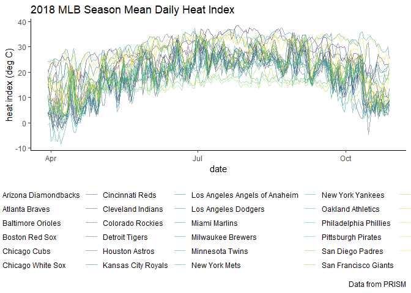

weather\_data
================
Stephen Lewandowski
November 9, 2018

Index of stadiums
-----------------

Stadium index. Geocoded source: <https://fusiontables.google.com/DataSource?docid=1EXApOoxEgJUFlbMjUodfxBSWlRvgQNpABeddHqiN#rows:id=1>

``` r
stadium_index <-
  read.csv("./data/stadium_index.csv")
```

Import PRISM variables
----------------------

Import max and min daily temperatures and mean daily dew points for all MLB stadium locations from April 2015 to October 2018.

``` r
tmax <-
  read.csv("./data/tmax_ballpark_PRISM.csv") %>% 
    janitor::clean_names() %>% 
    select(-c("system_index", "geo")) %>% 
    select(team_name, everything()) %>% 
    gather(key = date, value = tmax, "x20150401":"x20181030")
  
tmin <-
  read.csv("./data/tmin_ballpark_PRISM.csv") %>% 
    janitor::clean_names() %>% 
    select(-c("system_index", "geo")) %>% 
    select(team_name, everything()) %>% 
    gather(key = date, value = tmin, "x20150401":"x20181030")

tdmean <-
  read.csv("./data/tdmean_ballpark_PRISM.csv") %>% 
    janitor::clean_names() %>% 
    select(-c("system_index", "geo")) %>% 
    select(team_name, everything()) %>% 
    gather(key = date, value = tdmean, "x20150401":"x20181030")
```

Join PRISM data
---------------

Join tmax, tmin and tdmean

``` r
weather <- as.tibble(
    full_join(tmax, tmin, by = c("team_name", "date")) %>% 
    full_join(., tdmean, by = c("team_name", "date")) %>% 
    mutate(date = str_replace(date, "x", ""),
           date = as.Date(date, format = "%Y%m%d"))
  )
```

Heat Index and RH
-----------------

This chunk creates daily heat index values from mean daily air temperature and mean daily dew point temperature. The `heat.index` function of the `weathermetrics` package is used. The heat index equation is derived from the US National Weather Service's online heat index calculator. The `dewpoint.to.humidity` function is used to obtain relative humidity.

``` r
weather <-
  weather %>% 
    mutate(tmean = (tmax + tmin)/2,
           heat_index = weathermetrics::heat.index(t = tmean, dp = tdmean, temperature.metric = "celsius", output.metric = "celsius", round = 2),
           rh = weathermetrics::dewpoint.to.humidity(dp = tdmean, t = tmean, temperature.metric = "celsius"))
```

    ## Warning in dewpoint.to.humidity(t = t, dp = dp, temperature.metric =
    ## temperature.metric): For some observations, dew point temperature was
    ## higher than temperature. Since dew point temperature cannot be higher than
    ## air temperature, relative humidty for these observations was set to 'NA'.

    ## Warning in weathermetrics::dewpoint.to.humidity(dp = tdmean, t = tmean, :
    ## For some observations, dew point temperature was higher than temperature.
    ## Since dew point temperature cannot be higher than air temperature, relative
    ## humidty for these observations was set to 'NA'.

``` r
weather
```

    ## # A tibble: 37,961 x 8
    ##    team_name         date        tmax   tmin tdmean tmean heat_index    rh
    ##    <fct>             <date>     <dbl>  <dbl>  <dbl> <dbl>      <dbl> <dbl>
    ##  1 Minnesota Twins   2015-04-01  17.9  0.160  -1.07  9.02       7.27  49.6
    ##  2 Seattle Mariners  2015-04-01  12.3  6.41    4.47  9.34       8.2   71.9
    ##  3 San Francisco Gi~ 2015-04-01  16.3 11.2     6.92 13.8       12.9   63.5
    ##  4 Oakland Athletics 2015-04-01  19.3 10.7     6.31 15.0       14     56.4
    ##  5 Los Angeles Dodg~ 2015-04-01  24.3 13.2    11.1  18.8       18.3   61.2
    ##  6 San Diego Padres  2015-04-01  20.0 15.7    12.2  17.9       17.5   69.7
    ##  7 Los Angeles Ange~ 2015-04-01  23.2 13.6    11.7  18.4       18     65.0
    ##  8 Houston Astros    2015-04-01  28.3 17.6    18.0  23.0       23.2   73.6
    ##  9 Texas Rangers     2015-04-01  28.3 17.8    16.3  23.1       23.1   65.9
    ## 10 Arizona Diamondb~ 2015-04-01  34.1 18.8     1.54 26.4       25.7   19.8
    ## # ... with 37,951 more rows

Export tidy weather dataframe
-----------------------------

``` r
write_csv(weather, path = "./data/weather.csv")
```

Heat Index plot
---------------

``` r
weather %>%
  filter(date > "2018-03-29" & date < "2018-10-29") %>% 
ggplot(aes(x = date, y = heat_index)) + 
  geom_line(aes(color = team_name), alpha = .5) + 
  labs(
    title = "2018 MLB Season Mean Daily Heat Index",
    x = "date",
    y = "heat index (deg C)",
    caption = "Data from PRISM"
  ) + 
  viridis::scale_color_viridis(
    name = "Location", 
    discrete = TRUE
  ) + 
  theme_classic() + 
  theme(legend.position = "bottom")
```



### Google Earth Engine Javascrip code

Example for PRISM mean daily dew point temperature:

// Load a Fusion Table from the ID using the FeatureCollection constructor.

var ballpark = ee.FeatureCollection("ft:1EXApOoxEgJUFlbMjUodfxBSWlRvgQNpABeddHqiN");

var usa = ee.FeatureCollection("ft:1ksBc\_-cWnek37HFTMr0FXfBtOETBeYYbB1YeSg");

// Load PRISM input imagery. var tmax = ee.ImageCollection(PRISM) .filterDate('2015-04-01', '2018-10-31') .select('tmax');

var tmin = ee.ImageCollection(PRISM) .filterDate('2015-04-01', '2018-10-31') .select('tmin');

var tdmean = ee.ImageCollection(PRISM) .filterDate('2015-04-01', '2018-10-31') .select('tdmean');

/////////////////////////////////////////////////////////

//Create a collection of triplets, {imageID, ballpark, first}:

var triplets = tdmean.map(function(image) { return image.select('tdmean').reduceRegions({ collection: ballpark.select(\['Team Name'\]), reducer: ee.Reducer.first(), scale: 1000 }).filter(ee.Filter.neq('first', null)) .map(function(f) { return f.set('imageId', image.id()); }); }).flatten();

print(triplets.first()); //properties: ballpark, imageId, first

//////////////////////////////////////////////////////////////////////////

// Format a table of triplets into a 2D table of rowId x colId. var format = function(table, rowId, colId) { // Get a FeatureCollection with unique row IDs. var rows = table.distinct(rowId); // Join the table to the unique IDs to get a collection in which // each feature stores a list of all features having a common row ID. var joined = ee.Join.saveAll('matches').apply({ primary: rows, secondary: table, condition: ee.Filter.equals({ leftField: rowId, rightField: rowId }) });

return joined.map(function(row) { // Get the list of all features with a unique row ID. var values = ee.List(row.get('matches')) // Map a function over the list of rows to return a list of // column ID and value. .map(function(feature) { feature = ee.Feature(feature); return \[feature.get(colId), feature.get('first')\]; }); // Return the row with its ID property and properties for // all matching columns IDs storing the output of the reducer. // The Dictionary constructor is using a list of key, value pairs. return row.select(\[rowId\]).set(ee.Dictionary(values.flatten())); }); };

var table1 = format(triplets, 'Team Name', 'imageId'); var desc2 = 'tdmean';

Export.table.toDrive({ collection: table1, description: desc2, fileNamePrefix: desc2, fileFormat: 'CSV' });
